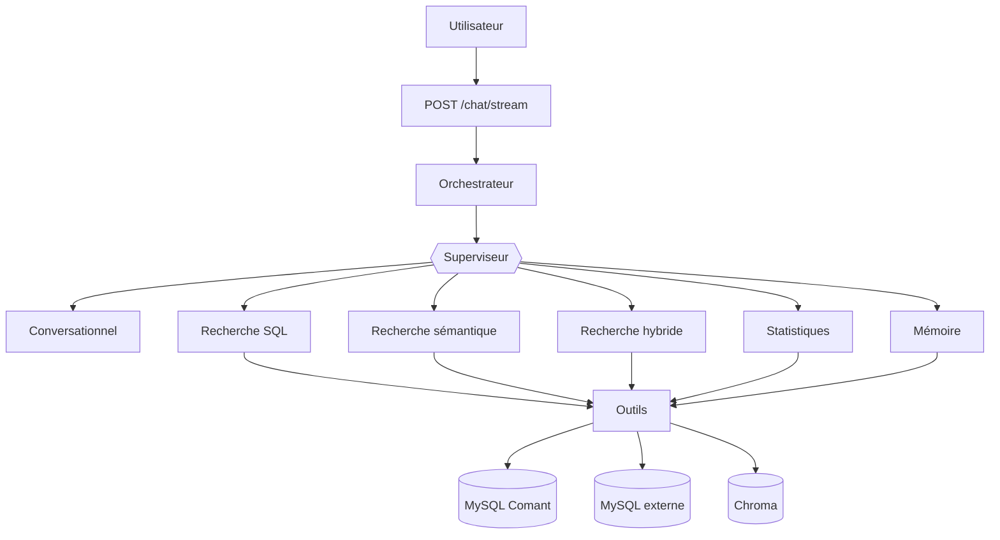

# Chatbot API Comant

API FastAPI qui place un système multi-agents devant la base de tickets Comant. L'utilisateur écrit en langage naturel, le chatbot construit la requête SQL correspondante, l'exécute, et renvoie la recherche à l'application Comant qui l'affiche.

Tout tourne en local : les modèles de langage sont servis par Ollama, aucune donnée ne sort de l'infrastructure.

---

## Table des matières

- [Ce que fait l'application](#ce-que-fait-lapplication)
- [Stack technique](#stack-technique)
- [Architecture](#architecture)
- [Les agents](#les-agents)
- [Les outils](#les-outils)
- [Les types de recherche](#les-types-de-recherche)
- [Mémoire et apprentissage](#mémoire-et-apprentissage)
- [Les bases de données](#les-bases-de-données)
- [Le flux de réponse](#le-flux-de-réponse)
- [Endpoints](#endpoints)
- [Configuration](#configuration)
- [Installation et exécution](#installation-et-exécution)
- [Scripts utilitaires](#scripts-utilitaires)
- [Structure du projet](#structure-du-projet)
- [Qualité de code](#qualité-de-code)

---

## Ce que fait l'application

- **Chercher des tickets** par filtres exacts (projet, client, statut, assigné, dates…), par thème, ou les deux à la fois.
- **Affiner** une recherche existante au fil de la conversation, sans tout reformuler.
- **Calculer des statistiques** (temps passé, répartitions, estimations) et choisir leur représentation graphique — réservé aux administrateurs.
- **Sauvegarder, renommer, supprimer** une recherche ou une statistique.
- **Apprendre des corrections** de l'utilisateur : règles métier, vocabulaire, erreurs de routage.
- **Nommer automatiquement** les conversations.

---

## Stack technique

| Rôle | Technologie |
|---|---|
| API web | FastAPI + Uvicorn, réponses en streaming |
| Framework d'agents | Pydantic AI |
| Modèles de langage | Ollama, via son endpoint compatible OpenAI |
| Embeddings | Ollama (`/api/embed`) |
| Base vectorielle | Chroma (client HTTP asynchrone) |
| Base de données | MySQL, via PyMySQL |
| Correspondance approximative | RapidFuzz |
| Nettoyage HTML | BeautifulSoup |
| Observabilité | Logfire (FastAPI et Pydantic AI instrumentés) |
| Configuration | Pydantic Settings (`.env`) |
| Qualité de code | Ruff (lint + format), vérifié en CI |

Le modèle de langage est partagé par tous les agents et mis en cache. Seule la **température** change d'un agent à l'autre : `0.0` pour tout ce qui doit être contraint (routage, génération SQL), `0.2` pour ce qui reformule des données existantes, `0.6` pour la conversation libre.

---

## Architecture

Une requête traverse quatre couches :

```
FastAPI (main.py)
   └── Orchestrateur (agents/orchestrator.py)   → gère le streaming et les événements
         └── Superviseur (agents/supervisor.py) → décide QUOI faire
               └── Agent spécialiste            → fait le travail
                     └── Outils (agents/tools/) → parlent aux bases de données
```



Le **contexte de la conversation** est créé à l'entrée de la requête et circule ensuite partout : superviseur, spécialiste, outils. Il porte l'utilisateur connecté, l'historique récent, la recherche en cours, et sert aussi de zone de dépôt — un outil y écrit son résultat (la requête SQL exécutée, par exemple) pour que la couche de délégation le récupère et le persiste.

---

## Les agents

Le **superviseur** est le seul point d'entrée. Il lit l'historique récent puis le message, et choisit **un seul** outil de délégation. Il n'écrit jamais de SQL lui-même : il route, puis relaie la réponse du spécialiste.

Sa première règle est de vérifier si le message répond à une question qu'il vient de poser (« Quel nom voulez-vous donner à cette recherche ? », « Vouliez-vous dire le projet Comant2026 ? »). Dans ce cas, c'est le couple question + réponse qui détermine la suite, jamais la réponse isolée — sans quoi un simple « oui » serait ininterprétable.

| Agent | Rôle | Température |
|---|---|---|
| **Superviseur** | Route vers un spécialiste, gère renommage et suppression | 0.0 |
| **Recherche SQL** | Recherche par filtres exacts, et affinage | 0.0 |
| **Recherche sémantique** | Recherche par thème, gestion du vocabulaire | 0.2 |
| **Recherche hybride** | Filtres exacts **et** thème dans une même requête | 0.0 |
| **Statistiques** | Indicateurs agrégés et choix du graphe (admins) | 0.0 |
| **Mémoire** | Enregistre, modifie et supprime les souvenirs | 0.2 |
| **Juge mémoire** | Compare un nouveau souvenir à ceux déjà stockés | 0.0 |
| **Conversationnel** | Salutations, aide, hors-périmètre | 0.6 |

Chaque spécialiste reconstruit son prompt système **à chaque requête** : il y injecte le schéma réel de la base (lu en direct, jamais figé dans le code) et les souvenirs pertinents pour la demande en cours.

Deux garde-fous protègent les sorties, utiles avec des modèles locaux de taille modeste :

- un **anti-fuite d'appel d'outil**, sur tous les agents : si le modèle écrit un appel d'outil en texte au lieu de l'exécuter, il est renvoyé corriger sa réponse ;
- un **contrôle de complétude** sur l'agent hybride : il ne peut pas conclure s'il a préparé le filtre sémantique sans exécuter la recherche.

---

## Les outils

Les agents n'accèdent jamais directement aux bases : ils passent par des outils, qui déportent les appels bloquants sur un thread pour ne pas figer le streaming.

- **Base de données** — lecture du schéma, exécution d'un `SELECT`, exécution d'une requête d'agrégation, exécution sur la base externe. En cas d'erreur SQL, l'outil **ne lève pas d'exception** : il renvoie le message d'erreur à l'agent, qui corrige sa requête et réessaie. C'est la boucle d'auto-correction.
- **Entités** — valide les noms cités (projet, client, utilisateur, composant, produit, tag, branches) contre les valeurs réellement présentes en base, avec une correspondance approximative. Trois verdicts : `ok`, `suggestion` (l'agent demande confirmation à l'utilisateur), `unknown` (l'agent signale que la valeur n'existe pas). Les valeurs sont mises en cache une trentaine de minutes.
- **Sémantique** — recherche vectorielle de tickets, et gestion du vocabulaire métier.
- **Mémoire** — récupération des souvenirs pertinents, écriture, mise à jour, suppression.
- **Persistance** — création et mise à jour des recherches et des statistiques.

---

## Les types de recherche

### Par filtres exacts

> « Les tickets du projet Comant2026 créés par sls »

L'agent valide les entités citées, construit la requête à partir du schéma réel et des règles métier, l'exécute, puis répond avec le nombre de résultats et les filtres appliqués.

### Par thème

> « Les tickets qui parlent de cinématique »

Le thème est d'abord enrichi des synonymes connus, puis converti en embeddings et comparé aux tickets indexés dans Chroma. Les résultats sont ensuite **reclassés par priorité lexicale** : un ticket dont le titre contient le terme exact passe devant un ticket seulement proche sémantiquement. Cinq niveaux, du plus littéral au plus flou, dont la répartition est annoncée à l'utilisateur.

La requête produite est une liste d'identifiants (`WHERE t.id IN (…)`), ce qui la rend interchangeable avec une recherche par filtres du point de vue de l'application.

### Hybride

> « Les tickets du client TPC qui parlent d'annotations 3D »

L'agent découpe la demande en deux : les critères structurés d'un côté, le thème de l'autre. La recherche sémantique devient alors **un filtre de plus** dans la requête SQL, et non une requête concurrente.

Les identifiants ne transitent jamais par le modèle : l'outil sémantique rend un marqueur, l'agent l'insère tel quel dans sa clause `WHERE`, et la liste réelle est substituée juste avant l'exécution. L'ordre de pertinence sémantique est préservé dans le résultat final.

### Statistiques

> « Le temps effectif par salarié pour le projet CAO2026 »

L'agent produit une requête d'agrégation, puis choisit le type de graphe et les libellés. Si la demande porte sur les absences, une seconde requête est exécutée sur la base externe et fusionnée avec la première sur leurs colonnes communes. Fonctionnalité réservée aux administrateurs.

### Affinage

> « Garde seulement les fermés », « ajoute aussi les urgents »

L'agent repart de la **dernière requête exécutée** et la modifie, au lieu d'en écrire une nouvelle. Cela vaut pour les recherches comme pour les statistiques — dans ce dernier cas, aussi bien sur les filtres que sur le type de graphe ou les libellés.

---

## Mémoire et apprentissage

Quand l'utilisateur corrige le chatbot, la correction est enregistrée et réinjectée plus tard, automatiquement, dans le prompt de l'agent concerné.

Un souvenir porte quatre attributs :

- **l'agent destinataire** — celui qui devra respecter la règle ;
- **le type** — une règle de comportement, ou du vocabulaire (des synonymes rattachés à un terme) ;
- **la portée** — propre à l'utilisateur, ou globale ;
- **le déclencheur** — la demande qui avait causé l'erreur. C'est lui qui est vectorisé : quand une future demande lui ressemble, la règle est réinjectée.

Avant toute écriture, un **agent juge** compare le nouveau souvenir à ceux, proches, déjà stockés, et tranche : doublon (rien n'est écrit), complément (les deux règles sont fusionnées), contradiction (l'ancienne est remplacée), ou sans rapport (écriture normale). La mémoire ne se contente donc pas d'empiler des règles, elle se réconcilie.

Le même mécanisme sert à **guider le routage** du superviseur : des exemples de délégation sont stockés comme souvenirs globaux et réinjectés par similarité avec la demande en cours. Ajouter un exemple est souvent plus efficace que rallonger un prompt.

### Résumés de conversation

Une conversation restée sans activité pendant une trentaine de minutes est résumée par un agent dédié, et le résumé est stocké dans Chroma. Le travail se fait **hors du flux de chat**, par un script rejouable : résumer coûte un appel au modèle, et un résumé de conversation en cours serait périmé au message suivant. L'identifiant Chroma étant celui de la conversation, régénérer un résumé le remplace ; l'id du dernier message résumé est conservé en métadonnée pour détecter ce qui est périmé.

Le résumé est un artefact **dérivé** : il ne contient pas ce que MySQL sait déjà restituer (messages, intentions, SQL généré), mais l'objectif réel de l'échange, les sujets abordés, ce que les recherches ont donné, les corrections de l'utilisateur et l'issue.

Il n'est jamais injecté d'office dans les prompts. L'agent conversationnel dispose d'un outil qui va le chercher **uniquement** quand l'utilisateur fait référence à un échange antérieur (« qu'avions-nous conclu sur les annotations 3D ? »), filtré sur son propre `user_id`. C'est la différence avec les souvenirs : ceux-ci sont des règles à appliquer automatiquement, les résumés sont des faits consultés à la demande.

---

## Les bases de données

### MySQL — base Comant (principale)

En lecture :

- le **schéma** (tables, colonnes, types, clés étrangères), relu à chaque requête et injecté dans les prompts, pour que les agents ne travaillent jamais sur une structure périmée ;
- les **tickets** et toutes les tables métier, via les requêtes générées ;
- les **valeurs d'entités** (codes projet, noms de clients, trigrammes…), qui alimentent le cache de validation.

En écriture :

| Table | Ce qui y est écrit |
|---|---|
| `research` | La requête SQL de chaque recherche, ses colonnes d'affichage et un indicateur `is_semantic` — c'est l'objet que l'application Comant affiche |
| `statistics` | Requête, résultat, type de graphe, libellés |
| `message` | Intention retenue et recherche associée au message |
| `conversation` | Nom généré automatiquement |

### MySQL — base externe

Consultée uniquement pour les statistiques d'absences. Son résultat est fusionné avec celui de la requête principale sur leurs colonnes communes.

### Chroma — base vectorielle

Trois collections, en distance cosinus :

| Collection | Contenu |
|---|---|
| `tickets` | Titre, description et commentaires de chaque ticket, HTML nettoyé |
| `memories` | Souvenirs, corrections, vocabulaire, exemples de routage |
| `conversation_summaries` | Un résumé par conversation terminée |

Les tickets sont indexés en masse par un script, puis mis à jour à l'unité via un endpoint que l'application Comant appelle à chaque création ou modification de ticket.

---

## Le flux de réponse

`/chat/stream` renvoie un flux en trois temps :

1. des **événements JSON**, une ligne chacun — intention retenue, recherche créée, statistique créée, action effectuée, correction enregistrée, erreur ;
2. la sentinelle `[STREAM_START]` ;
3. la **réponse en langage naturel**, mot à mot.

Les événements d'intention sont émis **au plus tôt**, avant même que la recherche ne commence, pour que l'interface puisse afficher immédiatement son indicateur de chargement. Les autres sont accumulés pendant l'exécution, puis vidés juste avant la sentinelle.

---

## Endpoints

| Méthode | Route | Rôle |
|---|---|---|
| `POST` | `/chat/stream` | Point d'entrée du chat, réponse en streaming |
| `POST` | `/name/create` | Génère et enregistre le nom d'une conversation |
| `GET` | `/memory/get` | Liste tous les souvenirs |
| `POST` | `/memory/add` | Ajoute un souvenir |
| `POST` | `/memory/modify` | Modifie un souvenir |
| `POST` | `/memory/delete` | Supprime un souvenir |
| `POST` | `/memory/recover` | Restaure un souvenir supprimé |
| `POST` | `/embed/add` | Indexe ou réindexe un ticket dans Chroma |
| `GET` | `/health` | État du service |

La documentation interactive est disponible sur `/docs`.

---

## Installation et exécution

**Prérequis** : Python 3.11+, un serveur MySQL, Ollama et Chroma.

```bash
# Dépendances
python -m venv .venv
source .venv/bin/activate          # Windows : .venv\Scripts\activate
pip install -r requirements.txt

# Modèles
ollama pull ministral-3:14b
ollama pull qwen3-embedding:4b
ollama serve

# Base vectorielle
chroma run --host localhost --port 8001

# API
uvicorn app.main:app --reload
```

Au premier démarrage, il faut indexer les tickets et charger les exemples de routage :

```bash
python -m app.scripts.embedding_generation_chroma
python -m app.scripts.init_supervisor_actions --init
```

---

## Scripts utilitaires

| Script | Rôle |
|---|---|
| `embedding_generation_chroma` | Indexe tous les tickets dans Chroma |
| `generate_conversation_summaries` | Résume les conversations au repos (à planifier) |
| `init_supervisor_actions` | Charge, liste ou supprime les exemples de routage |
| `add_supervisor_example` | Ajoute un exemple de routage à l'unité |
| `inspect_chroma` | Inspecte le contenu des collections |
| `inspect_memories` | Inspecte les souvenirs enregistrés |
| `test_semantic_search` | Teste une recherche sémantique isolément |
| `delete_chroma_collections` | Réinitialise les collections |

Tous s'exécutent en module, depuis la racine : `python -m app.scripts.<nom>`.

---

## Structure du projet

```
app/
├── main.py                  # Endpoints FastAPI
├── config.py                # Configuration (.env)
├── models/                  # Schémas des requêtes entrantes
├── agents/
│   ├── orchestrator.py      # Streaming et émission des événements
│   ├── supervisor.py        # Routage vers les spécialistes
│   ├── deps.py              # Contexte partagé de la conversation
│   ├── model.py             # Modèle partagé et profils de température
│   ├── specialists/         # Un fichier par agent
│   ├── prompts/             # Un fichier de prompt par agent
│   ├── tools/               # Outils : base, entités, sémantique, mémoire…
│   └── util/                # Historique, garde-fous de sortie
├── services/
│   ├── database.py          # Connexions et requêtes MySQL
│   ├── vectorstore.py       # Chroma : tickets, mémoires, vocabulaire
│   ├── entity_cache.py      # Cache et correspondance approximative
│   ├── events.py            # Protocole d'événements streamés
│   ├── conversation_name.py # Nommage des conversations
│   └── ollama.py            # Appels directs à Ollama
├── scripts/                 # Scripts d'administration
└── tests/                   # Jeu de requêtes de référence
```

Les prompts sont volontairement séparés du code — un fichier par agent dans `agents/prompts/` — ce qui permet de les faire évoluer sans toucher à la logique.

---

## Qualité de code

Le projet utilise Ruff pour le lint et le formatage (lignes à 100 caractères, guillemets doubles). Une action GitHub corrige et formate automatiquement le code à chaque pull request vers `main`.

```bash
ruff check app
ruff format app
```

`app/tests/requetes_test.json` contient un jeu de requêtes en langage naturel associées à leur requête SQL attendue, utilisable pour vérifier les régressions sur la génération SQL.
